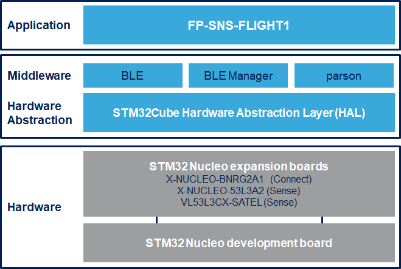

# FP-SNS-FLIGHT1 Firmware Package

The FP-SNS-FLIGHT1 is an STM32Cube function pack which lets you connect your IoT node to a smartphone via BLE and use a suitable Android or iOS like the ST BLE Sensor app to view real-time time-of-flight sensors data.
This package, together with the suggested combination of STM32 and ST devices can be used to develop specific wearable applications, or smart things applications in general.

The software runs on the STM32 microcontroller and includes all the necessary drivers to recognize the devices on the STM32 Nucleo development board and expansion boards.

The expansion is built on STM32Cube software technology to ease portability across different STM32 microcontrollers.

**FP-SNS-FLIGHT1 software features**

- Complete firmware to develop an IoT node with BLE connectivity and time-of-flight sensors

- Sample implementation available for X-NUCLEO-53L3A2 and X-NUCLEO-BNRG2A1 connected to a NUCLEO-F401RE or NUCLEO-L476RG or NUCLEO-U575ZI-Q

- Sample implementation available for VL53L3CX-SATEL and X-NUCLEO-BNRG2A1 connected to a NUCLEO-F401RE or NUCLEO-L476RG or NUCLEO-U575ZI-Q

- Firmware compatible with ST BLE Sensor applications for Android/iOS, to perform sensor data reading, motion algorithm features demo and firmware update (Version 5.2.0/5.2.0 or higher)

- Easy portability across different MCU families, thanks to STM32Cube

- Free, user-friendly license terms

This firmware package includes Components Device Drivers, Board Support Package and example application for the STMicroelectronics:

- NUCLEO-F401RE nucleo development board and expansion boards:
  - X-NUCLEO-BNRG2A1 Bluetooth Low Energy expansion board based on the BLUENRG-M2SP module for STM32 Nucleo
  - X-NUCLEO-53L3A2 ranging sensor with multi object detection and FoV (field of view) programming.
  
- NUCLEO-F401RE nucleo development board and expansion boards:
  - X-NUCLEO-BNRG2A1 Bluetooth Low Energy expansion board based on the BLUENRG-M2SP module for STM32 Nucleo
  - VL53L3CX-SATEL Breakout board with VL53L3CX multi-target detection ToF ranging sensor for easy integration into customer device.
  
- NUCLEO-L476RG nucleo development board and expansion boards:
  - X-NUCLEO-BNRG2A1 Bluetooth Low Energy expansion board based on the BLUENRG-M2SP module for STM32 Nucleo
  - X-NUCLEO-53L3A2 ranging sensor with multi object detection and FoV (field of view) programming.
  
- NUCLEO-L476RG nucleo development board and expansion boards:
  - X-NUCLEO-BNRG2A1 Bluetooth Low Energy expansion board based on the BLUENRG-M2SP module for STM32 Nucleo
  - VL53L3CX-SATEL Breakout board with VL53L3CX multi-target detection ToF ranging sensor for easy integration into customer device.
  
- NUCLEO-U575ZI-Q nucleo development board and expansion boards:
  - X-NUCLEO-BNRG2A1 Bluetooth Low Energy expansion board based on the BLUENRG-M2SP module for STM32 Nucleo
  - X-NUCLEO-53L3A2 ranging sensor with multi object detection and FoV (field of view) programming.
  
- NUCLEO-U575ZI-Q nucleo development board and expansion boards:
  - X-NUCLEO-BNRG2A1 Bluetooth Low Energy expansion board based on the BLUENRG-M2SP module for STM32 Nucleo
  - VL53L3CX-SATEL Breakout board with VL53L3CX multi-target detection ToF ranging sensor for easy integration into customer device.

Here is the list of references to user documents:

- [DB2862: STM32Cube function pack for IoT node with BLE connectivity and Time-of-Flight sensors](https://www.st.com/resource/en/data_brief/fp-sns-flight1.pdf)
- [UM2026: Getting started with the STM32Cube function pack for IoT node with BLE connectivity and time-of-flight sensors](https://www.st.com/resource/en/user_manual/um2026-getting-started-with-the-stm32cube-function-pack-for-iot-node-with-nfc-ble-connectivity-and-timeofflight-sensors-stmicroelectronics.pdf)
- [FP-SNS-FLIGHT1 Quick Start Guide](https://www.st.com/content/ccc/resource/sales_and_marketing/presentation/product_presentation/group0/80/95/e3/1e/fa/47/49/0d/FP-SNS-FLIGHT1%20Quick%20start%20guide/files/fp-sns-flight1_quick_start_guide.pdf/jcr:content/translations/en.fp-sns-flight1_quick_start_guide.pdf)

## Supported Devices and Boards

- NUCLEO-F401RE STM32 Nucleo-64 development board with STM32F401RE MCU, supports Arduino and ST morpho connectivity \[[NUCLEO-F401RE](https://www.st.com/content/st_com/en/products/evaluation-tools/product-evaluation-tools/mcu-mpu-eval-tools/stm32-mcu-mpu-eval-tools/stm32-nucleo-boards/nucleo-f401re.html)\]
- NUCLEO-L476RG STM32 Nucleo-64 development board with STM32L476RG MCU, supports Arduino and ST morpho connectivity \[[NUCLEO-L476RG](https://www.st.com/content/st_com/en/products/evaluation-tools/product-evaluation-tools/mcu-mpu-eval-tools/stm32-mcu-mpu-eval-tools/stm32-nucleo-boards/nucleo-l476rg.html)\]
- NUCLEO-U575ZI-Q STM32 Nucleo-144 development board with STM32U575ZIT6Q MCU, SMPS, supports Arduino, ST Zio and morpho connectivity \[[NUCLEO-U575ZI-Q](https://www.st.com/en/evaluation-tools/nucleo-u575zi-q.html)\]
- X-NUCLEO-BNRG2A1 Bluetooth Low Energy expansion board based on the BLUENRG-M2SP module for STM32 Nucleo \[[X-NUCLEO-BNRG2A1](https://www.st.com/en/ecosystems/x-nucleo-bnrg2a1.html)]
- X-NUCLEO-53L3A2 Motion MEMS and environmental sensor expansion board for STM32 Nucleo \[[X-NUCLEO-53L3A2](https://www.st.com/en/evaluation-tools/x-nucleo-53l3a2.html)\]
- VL53L3CX-SATEL Breakout board with VL53L3CX multi-target detection ToF ranging sensor for easy integration into customer device \[[VL53L3CX-SATEL](https://www.st.com/en/evaluation-tools/vl53l3cx-satel.html)\]

## Known Issues

- None

## Development Toolchains and Compilers

-   IAR Embedded Workbench for ARM (EWARM) toolchain V9.20.1 + STLink/V2
-   RealView Microcontroller Development Kit (MDK-ARM) toolchain V5.38.0 + ST-LINK/V2
-   Integrated Development Environment for STM32 (STM32CubeIDE) V1.17.0 + ST-LINK
	
## Dependencies 

This software release is compatible with:

- [**ST BLE Sensor Android application**](https://play.google.com/store/apps/details?id=com.st.bluems)  V5.2.0 (or higher)
- [**ST BLE Sensor iOS application**](https://apps.apple.com/it/app/st-ble-sensor/id993670214)  V5.2.0 (or higher)
